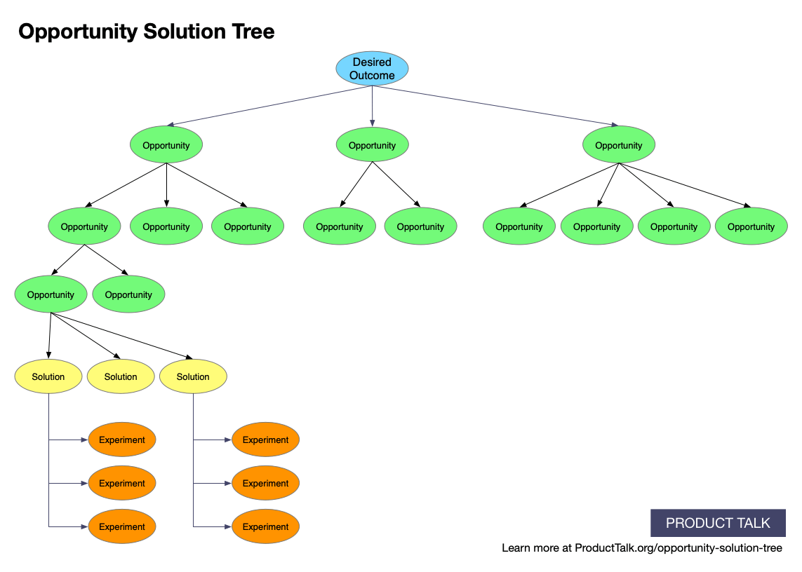

# Continuous Discovery Habits - Teresa Torres

## Chapter 1: The What and Why of Continuous Discovery

### Key Insights

* All product teams do a set of activities to decide **what to build**, i.e., `DISCOVERY`, and then do a different set of activities to **build and deliver** it, i.e., `DELIVERY`.
  * Companies often **prioritize delivery to discovery**. They focus on **exploitation** rather than **exploration**.
* A huge mistake is when a team is **measured by what they delivered, instead of what value they created** for the customer.
* Products should be conceived, designed, built and delivered by `CROSS-FUNCTIONAL TEAMS` consisting of **product managers**, **designers** and **software engineers**.
* `CONTINUOUS DISCOVERY` - At a minimum, **weekly touchpoints with customer** by the **team building the product** where they conduct **small research activities** in pursuit of a **desired outcome**.
* **Prerequisite mindsets** for proper adoption of **continuous discovery habits**:

| Mindset            | Description                                                           |
| ------------------ | --------------------------------------------------------------------- |
| `OUTCOME ORIENTED` | Think in `OUTCOMES` rather than `OUTPUTS`                             |
| `CUSTOMER CENTRIC` | Customer at the center of the universe                                |
| `COLLABORATIVE`    | Leverage epxertise and knowledge of the whole team                    |
| `VISUAL`           | Visualize, draw, map what you know in images/diagrams                 |
| `EXPERIMENTAL`     | Identifying assumptions and gathering evidence |
| `CONTINUOUS`       | Evolve from a `PROJECT MINDSET` to a `CONTINUOUS MINDSET`             |

### Important Facts

* In 2001, the `AGILE MANIFESTO` advocated for **shorter cycles** with **frequent customer feedback**.
  * Instead of validating the ideas with customers at the end of discovery, it is paramount to start co-creating with them from the outset.

### Memorable Quotes

## Chapter 2: A Common Framework for Continuous Discovery

### Key Insights

* Moving from the `OUTPUT MINDSET` to `OUTCOME MINDSET` means **emphasizing the impact** the product/features on the **customers** as well as the **business** itself.
* **Identifying the best path** to the **desired outcome** is a `WICKED PROBLEM`, i.e., a problem that is **ill-structured** (**ill-posed**) and has many solutions.
  * Much of the work in tackling an ill-structured problem is spent by framing the problem itself.
* The **objective** is to identify `OPPORTUNITIES`, that are **customer needs**, **pain points** and **desires**.
* Two steps for the **product trio** to reach the desired outcome are `OPPORTUNITY SPACE MAPPING` and subsequent `OPPORTUNITY SELECTION`.
* The `DISCOVERY` process:
  1. **Define a clear outcome** which **sets the scope** for discovery.
  2. **Map out the opportunity space**.
  3. **Frame the problem**.
  4. Analyze the **solution space**.
  5. **Discover solutions**.
* `OPPORTUNITY SOLUTION TREE` is a simple way of representing paths one might take to reach a desired outcome.
  * The **root** is the `DESIRED OUTCOME`, followed by an `OPPORTUNITY SPACE` upon which the `SOLUTION SPACE` is built. Finally, there are `ASSUMPTION TESTS`.

|  |
| :---: |
| *Visualization of the **opportunity solution tree**.* |

### Important Facts

### Memorable Quotes

> *If I had an hour to solve a problem, I'd spend 55 minutes thinking about the problem and 5 minutes thinking about solutions. - Albert Einstein*

## Chapter 3: 

### Key Insights

### Important Facts

### Memorable Quotes