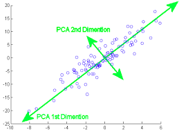
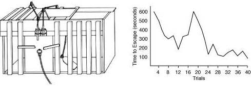

# The Alignment Problem - Brian Christian

## Chapter 1: "*Representation*"

### Problems with data

* **Lack of diversity**.
  * An example of `class imbalance` problem.
  * `Labeled Faces in the Wild` (`LFW`) dataset contains $77\%$ males, and more than $83\%$ white people. It contains more pictures of George W. Bush than all the black females combined.
* **Easy dissemination**.
  * Any inherent bias becomes pervasive.
* `Shirley Card` - *Shirley Page*, a Kodak employee, was the first person to pose for the `color-balance benchmark` test picture.
  * Dataset is the *Shirley Card* of some machine learning models.

|  |
| :---: |
| For decades, Kodak's Shirley cards, like this one, features only white models. |

* At the beginning, photos of black people were not of good quality due to **not paying attention** to **proper calibration**.
  * It changed in the 60s and 70s when the furniture and chocolate industries focused on improving their pictures.
  * In the 90s the marketing was "*dark horse in low light*".
* Contrary to popular belief, many big tech companies and banks move glacially. Thus, if their models are trained on biased datasets, it becomes very problematic to change them down the road.

### Embeddings

* Unlike the `Bag-of-Words` (`BOW`) approach, i.e., word counting, embeddings are `distributed representations` that do not suffer from the `curse of dimensionality` as much. In a BOW approach, every word is the "same distance away" from others.
* **Training**.
  * `Contextual Bag-of-Words` (`CBOW`) - given a context, predict the middle word.
  * `Skip Grams` - given the middle word, predict a context.

|  |
| :---: |
| A comparison of **skip gram** and **CBOW** approaches to training **vector embeddings** in the context of **natural language**. |

* A useful tool to monitor society, both in retrospective and prospective ways (a "*big brother*").
* **Bias reinforcement**.
  * Resumé screening. The built-in bias reinforces who gets hired, thereby producing more biased data for subsequent model training.
* **De-biasing**.
  * It is like putting "*lipstick on a pig.*"
  * `Principal Component Analysis` (`PCA`) was used to find the dimension that explained the greatest amount of variation between word pairs such as "*male*" and "*female*", or "*kind*" and "*queen*". The assumption was that the *gender* was responsible.
  * Removal of problematic relationships does not work.
    * In 1952, Boston Symphony Orchestra began holding its auditions with a screen placed between the performer and the judge. Others followed suit in the 70s and 80s. However, they also had to instruct the candidates to remove their shoes before walking onto the wooden floor of the audition hall.
      * "*Machine learning models can hear the shoes!*"

|  |
| :--: |
| Visual example of the **PCA** where the **first two principal components** are depicted.

## Chapter 2: "*Fairness*"

* `COMPAS` - Correctional Offender Profiling for Alternative Sanctions.
  * A **linear model** based on a weighted average of features like age, age of the first arrest, criminal history, etc.
  * Its **prediction** was whether the defendant would re-offend within $1$-$3$ years.
  * `Exploratory data analysis` revealed that for black defendants, the distribution of re-offense scores was pretty uniform, whereas, in the case of white defendants, it was substantially skewed towards low-risk values.
  * `Calibration` was meant to assure that risk scores indicated equal probabilities of re-offending regardless of the race, which was shown to be correct.
    * Even though calibration is generally desirable, it provides little guarantee that decisions are equitable.
  * **Inherent flaw** in predictions was this. The model was $61$\% accurate. When its prediction was correct, race did not play a role. However, when the model was wrong, it was wrong in strikingly different ways for different races.
    * Black defendants were twice as likely to be rated as a higher risk but not re-offend. And white defendants were twice as likely to be charged with new crimes after being classed as lower risk.
* `Differential privacy` (**DP**) - A concept that allows companies to collect data about a population of users while maintaining the privacy of the individual users themselves.
  * It is a system for publicly sharing information about a dataset by describing the patterns of groups within the dataset while withholding information about individuals in the dataset.
  * Learn nothing about an individual while learning a lot about a population.

|  |
| :--: |
| **Differential privacy** mathematically guarantees that the result of analysis with or without the individual's private information will not be significantly impacted. |

* `Redundant encoding` - When an attribute is **strongly correlated** with **other** attributes.
  * Thinking that removing an attribute indicating a race group will prevent a model from being discriminatory toward a particular group is flawed due to redundant encoding.
  * Simply omitting the `protected attribute` makes it impossible not only to measure the bias but also to mitigate it.
* **Cambridge Analytica** (**CA**) has been suspected of directly influencing political campaigns.
  * In $2016$, Donald Trump's campaign was supported by the work of CA.
    * The approach seemed innocuous at first. Roughly $300\ 000$ people received a survey in which they used a scale from "strongly agree" to "strongly disagree" they were supposed to indicate their preference (or lack thereof) regarding various personality traits. Moreover, they were paid less than $5$\$. However, a requirement was to log in with their Facebook account. Thus, their location, name, liked pages and everything else were exploited in conjunction with their questionnaire response.
* **Equalizing**`False Positive Rates`**(**`FPR`**)** - There is a **threat of asymmetry**. The issue is that once there is an endeavor to equalize FPR in a risk-assessment context, i.e., ensuring that defendants who won't re-offend are no more likely to be improperly detained whether they are black or white, would entail different standards as long as the actual offense rates between the two groups are different.
* Crime generally occurs within the community, not between communities.
* One of the most important things in any prediction is to make sure that you're actually predicting what you think you are.
  * In the context of criminal behavior. Does the data actually capture reoffense or is it rather rearrest or reconviction? The data shows samples of criminal behavior that were punished, not the ones that evaded capture.
  * These models are trained to predict crime that becomes known to the police. In other words, they are predicting policing, not a crime.
  * Criminals who manage to evade getting caught will be treated as low-risk, thereby influencing the models so that similar people would get released on the basis of such a prediction trained using biased data.
  * There is a threat of a potential **long-term feedback loop**.
  * In this setting,  `selection bias` meets `confirmation bias`.
    * The system begins to sculpt the very reality it is meant to predict in the first place.
    * There is an old adage **Use Only As Directed**.
    * Imagine a model which predicts that the most reckless drivers are male. As a result, the police start aggressively pulling over male drivers. At the same time, female drivers realize they are less likely to be reprimanded or even punished with a fine, therefore, they become even more careless.
    

* Predictions are not an end in themselves. You should not predict just to predict.
  * What is better. A world in which we are $99$\% sure when and where a crime will happen, or where there is $99$\% less crime in general?
* One of the fundamental assumptions of machine learning practice is that your training data matches the distribution of your test data. However, this flatly contravenes many common use cases in which there is an attempt to intervene with the future and change it.

## Chapter 3: "*Transparency*"

* People should have a right to an **explanation** of **algorithmically made decisions** influencing them.
* A real-world use case of machine learning for **predicting** whether to treat a patient as **inpatient or outpatient**. The found rule was the following: *If a patient has a history of asthma, then they are low-risk and you should treat them as such.*
  * The reason is that the data **captures a significant fact in an inappropriate way**. Asthma is considered such a serious factor for pneumonia patients, that not only are they put in the hospital, but they are often treated right in the ICU. And fact causes such patients to appear to be low-risk since the attention they receive is enormous due to their history.
* `Generalized Additive Models`. A collection of graphs, each of which represents the influence of a single variable. It is basically a generalized linear model.
* `Explainable Artificial Intelligence` (`XAI`).
* `General Data Protection Regulation` (`GDPR`). In the context of deep learning, this is an intriguing problem. Getting intelligible **explanations out of a deep neural network** is an **unsolved scientific problem**, yet GDPR demands it.
* **Clinical vs. statistical prediction**. There was a case of a patient who thought that he was growing breasts. As a result, he was suspected to have been suffering from schizophrenia. However, no one actually cared to see whether he could have been right. Well, he, as it turned out, was right. He suffered from **Klinefelter syndrome**, a genetic condition caused by an additional X chromosome, that involves the development of breast tissue.
* **Linear model vs. a psychology expert**. The input to the model consisted of the student's high school class rank and their college aptitude test scores. On the other hand, the psychologist did not only have this information, but also the results of additional tests, notes from the interview, and their firsthand impression of the student. There was **no measurable difference** between the two predictions.
  * The reason is that the student counselors themselves did not place too much emphasis on the additional data, they also primarily relied on the school rank and test scores. However, their weighting was not as consistent as that of the model. And, obviously, the model can tune the weighting in an optimal fashion, therefore, achieving a slight competitive advantage.
* **Statistical analysis vs. human judgment**. The statistical analysis was thought to provide a floor to which the judgment of the experienced clinician could be compared. The floor turned out to be a ceiling. What's worse, even if the **clinician was provided with the model prediction, their judgment was still worse**.
  * However, these models were not just random linear combinations of random properties. They were random linear combinations of precisely the things that humans have established to be the most relevant and predictive things to consider through decades if not generations of best practices.
  * The **human expertise** is characterized by **knowing what to look for**, and **not** by **knowing the best way to integrate** that **information**.
* **Linear model to predict relationship harmony**. The linear prediction is the quintessence of simplicity. Subtract the rate of arguments from the rate of sexual interaction. A positive difference means happiness, a negative one unhappiness. **This model turned out to be an extremely accurate predictor**.
  * `Conditionally monotone independence`. Despite the enormous complexity of the real world, many high-level relationships are known as **conditionally monotone**, i.e., they do not interact with each other in particularly complex ways.
* **History is more relevant than symptoms**. Analysis of predictive models for patient health-related issues revealed that patient history was far more important for predictions than their immediate symptoms. In fact, even including the ongoing symptoms did not yield much of an improvement.
* `Cooperative eye hypothesis`. Why do we have distinctly large and visible sclera? Cooperation has been uncommonly important in our survival as species, to the point that the benefits of shared attention outweigh the loss of a certain degree of privacy. In the context of machine learning, this is related to `saliency`.
* A neural network was trained to classify whether an image contains an animal or not. It turned out that it based its classification output solely on the presence of the **Bokeh effect**.
  * `Bokeh effect`. The central image is focused whereas the background is blurred, creating an artistic impression.

|  |
| :---: |
| A demonstration of the so-called **Bokeh effect**. |

* A neural network was trained to classify tumors (malignant vs. benign). It learned that the presence of a ruler in malignant tumors is a relevant feature to look for.
  * `Multi-task learning` helps to diminish these effects since the model is forced to output more things which may be useful for validation as well as reduction of overfitting.
* Dumbbell classification without a presence of an arm was severely impaired as well.
* Patient's gender and age can be determined purely based on the image of their retina. A neural network actually discovered a way to interpret blood vessels appropriately.

## Chapter 4: "*Reinforcement*"

* `Motor automatism` is an ability to write words on paper **without thinking deliberately** about them.
  * In general,  `automatism` refers to a set of brief **unconscious behaviors**.
* `The Law of Effect`, proposed by *Edward Thorndike*, states that when previously **established modifiable connections** between a **situation** and a 
**response** are accompanied by a satisfying state of affairs, and the connection's strength is increased. Conversely, an annoying state of affairs has the opposite effect.

|  |
| :---: |
| Several **cats** were placed in a **puzzle box**. They were **rewarded with food and freedom** if they managed to solve the puzzle. Eventually, it took **less time** for the cats to escape after **multiple trials and rewards**. |

* `Homeostasis`. Getting back to the **baseline**. From Greek "*same*" and "*steady*". It refers to any process that living things use to **actively maintain fairly stable conditions** necessary for survival.
  * It has been argued that organisms evolved to maintain homeostasis or some sort of equilibrium.
    * Quenching thirst, quelling hunger.
* **Neurons are hedonists**. They pursue to **maximize** some approximate, local notion of **pleasure** while **minimizing pain**.
  * `Hedonism` refers to a **family of theories** in which **pleasure** plays a **central role**.
* `Feedback`. Simply put, an **information** used for **adjustment**.
  * **Thermostat** is a quintessential example of a **negative feedback loop**.
  * **Cyberneticists**, especially the pioneer of the field of `cybernetics` *Norbert Wiener*, claimed that essentially all **purposeful behavior** requires **negative feedback**. However, *Harry Klopf* argued that organisms were **maximizers** and not **minimizers**. He emphasized that living things aspire to reach boundless progress in any number of senses. He practically espoused the virtues of **positive** rather than **negative** feedback.

|  |
| :---: |
| *Nobert Wiener* was an American *mathematician* and *philosopher*. He is considered the originator of **cybernetics**.|

* `Reward hypothesis`. All of what we mean by goals and purposes can be thought of as the **maximization** of the **cumulative sum** of a received **scalar reward**, so
$$R = t_{t + 1} + \gamma r_{t + 2} + \gamma^2 t_{t + 3} + \dots.$$
* `Credit-assignment problem` emerges when the **final outcome** of a **decision process** is associated with a history of numerous partial decisions.
  * **Delayed feedback** is a particularly good precursor for having a hard time distinguishing "to which decision the credit should be assigned".
  * In other words, "*Where did I go wrong?*"
* `Dopamine`, or $3, 4$-`dihydroxyphenethylamine`, is produced by very specific neurons comprising only less than $1$\% of $1$\% of the brain. However, they are connected to millions of other neurons in the other parts of the brain.
* `Rescorla-Wagner model` suggested that **learning** is critically **dependant** upon **surprise**.
  * It is a **formal model** of the circumstances under which `Pavlovian conditioning occurs.

|  |
| :---: |
| An example of `classical conditioning` . In this experiment, the dog's inborn reflex to **salivate** at the prospect of **receiving food** was exploited to teach the dog to start salivating when the **bell was heard** but **no food was available**. During the process of training the dog, the two stimuli were present **simultaneously**, thereby producing an **association** between the two. |

* `Policy` - what to do when (also called a `strategy` in `game theory`). It describes the **decision-making** process of an `agent`.
  * A `stochastic policy` is a set of **conditional probability distributions**
$$\pi \left( a \ | \ S = s \right), \forall s \in \mathcal{S}.$$
  * A `deterministic policy` is a function
$$\pi: S \to \mathcal{A}.$$
  * **Policy-based** approaches lead to a well-learned "**muscle-memory**".
* `Value function` - what rewards or punishments to expect. It describes the **expected gain** $G_t$ from a given state. It is specified with respect to a specific **policy**, thus
$$v_{\pi} \left( s \right) = \mathbb{E}_{\pi} \left[ G_t \ | \ S_t = s \right].$$
  * **Value-based** approaches lead to a well-learned "**spider-sense**".
* `Actor-critic` approach is based on a **collaboration** of two components, **behavior** and **prediction**. The **actor** learn to take **optimal actions** whereas the **critic** learns to accurately predict **future rewards**.
* `Temporal difference`, or `TD learning`, relies on the **difference** between our successive **expectations and reality**, each of which is a **learned opportunity**.
  * We are learning a guess from a guess.
  * The **dopamine** itself is not a **reward**, also not the **expectation**, but rather a **difference** between the initial **expectation** and the **reality**. The **fluctuation**.
    * **Temporal learning** didn't just resemble the function of dopamine. It was the **dopamine** itself.
    * It's a very dangerous business to **artificially increase dopamine levels**. This substance can write checks the environment simply can't cash.

## Chapter 5: "*Shaping*"

* *Burrhus Frederic Skinner* conducted **experiments** in which the **reward** was provided after either a **fixed or variable number of specific behaviors or time**. He found out that the **most repetitive** and **persistent** behavior tended to come as a result of **variable ratio** schedule, i.e., when the reward would come after a certain number of behaviors, but the number would **fluctuate**.
  * This is why **gambling works**, among other things.
* It is a lot better to gradually **shape up** the behavior by **reinforcing** (rewarding) **crude approximations** of the desired outcome rather than waiting for a **complete response**.
  * We are **permanently reinforcing** the behavior of others, whether we mean to or not. *Skinner* noted that **parental attention** is a powerful **reinforcer** and that parents, by being slow to respond to polite requests, unwittingly train their children to be annoying and pushy.
  * In order to get **complex behavior**, we may first need to strategically reward **simpler** behavior, which is in every bit as applicable to humans as to animals.
    * This is how **curriculum** should work.
      * Even pigeons or monkeys were trained to do things people would otherwise consider impossible. The reason why they had not achieved those was because nature had not arranged effective sequences of schedules for them.
        * Having a **sparring partner** is an important part of learning.
      * **Breaking a problem down** in order to stay psychologically **motivated** is also paramount.
      * We are **biologically wired** and **culturally incentivized** to want specific things in the short-term in order to reach ill-posed, hard-to-define **evolutionary goals** in the **long-term**.
        * Always eating as much sugar and fat as possible is optimal as long as the environment does not provide these resources in excess.
* `Exploration vs. exploitation` is related to $\epsilon$-`greedy` approach in reinforcement learning, such that $\epsilon \in \left( 0, 1 \right)$. The **agent** executes actions in the environment it believes to be "optimal" $1 - \epsilon$ of the time (**exploitation**). However, $\epsilon$ of the time it tries something completely random (**exploration**).

| RL approach       | Description                                                               |
| ----------------- | ------------------------------------------------------------------------- |
| `model-free`      | Honing instincts.                                                         |
| `model-based`     | Understanding the world.                                                  |
| `value-learning`  | Learning **how much** reward certain states or actions can bring.         |
| `policy-learning` | Learning **which strategies** tend to on the whole do better than others. |

* One has to be careful about **rewarding A but hoping for B**.
  * Rewards should be thought of as a `conservative field` in physics.
    * It's like a **potential energy**, a function only of where you were, not how you got there, which means that going back to where you'd started was net zero.
    * One should **reward states, not actions**.
  * *Joshua Gans* mentioned that he once trained his daughter to help her younger brother go to the bathroom by rewarding her every time she did so. She found a loophole in this reward mechanism immediately and started pouring water into her brother regularly.
  * *Tom Griffiths* described a similar situation with his daughter when the rewarding system was exploited. She received praise for keeping the kitchen clean. She regularly took the brush and a pan and collected some dust and chips from the floor. Having been praised, she looked up, smiled, dumped the contents of the pan back on the floor, and started all over again.
---

## Top quotes

> Out of the crooked timber of humanity, no truly straight thing was ever made.

> Our law punishes people for what they do, not who they are. Dispensing punishment on the basis of an immutable characteristic flatly contravenes this guiding principle.

> Fairness through blindness does not work.

> Your scientists were so preoccupied with whether or not they could... that they didn't stop to think whether they should.

> Sometimes the "ground truth" is not the ground truth.

> Providing an overwhelming amount of information without adequate structure is not transparency.

> The act of giving a reason is the antithesis of authority. When the voice of authority fails, the voice of reason emerges, or vice versa.

> The whole trick is to know what variables to consider and then to know how to add.

> The trouble with modern theories of behaviorism is not that they are wrong but that they could become true.
